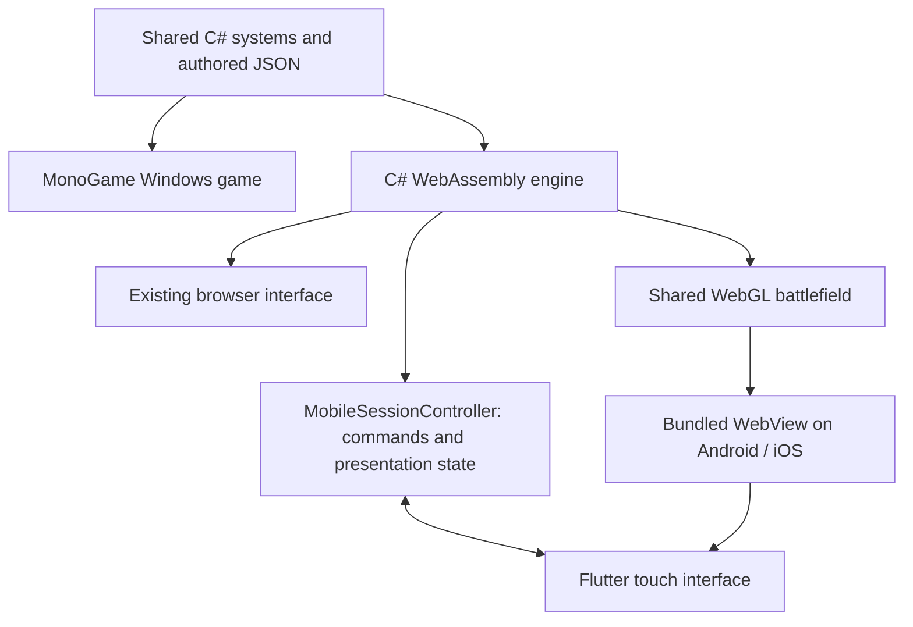

# Flutter mobile architecture

Maximal Bastion has one gameplay implementation. Windows compiles it against MonoGame; the browser and Flutter applications compile the same C# sources against KNI/WebAssembly. Flutter provides touch controls, adaptive layouts, navigation, native persistence hosting, and lifecycle handling. The battlefield retains the shared WebGL renderer.



## Ownership

| Concern | Source of truth |
| --- | --- |
| Damage, targeting, waves, economy, status effects, Protocols, upgrades, placement rules | `src/MaximalBastion` C# systems |
| Tower, enemy, map, wave and mode definitions | `src/MaximalBastion/ContentData` JSON |
| Actual and preview tower statistics | Shared `TowerInfo` calculations |
| Save/checkpoint/history/career schemas and validation | Shared persistence and analytics repositories |
| Battlefield visuals and audio | Existing renderer and audio system, hosted by `MaximalBastion.Web/MobileGame.cs` |
| Touch targets, tower dock, sheets/pages, navigation and zoom | `MaximalBastion.Mobile/lib/ui` |
| Mobile commands, validated state projections and fixed-step lifecycle | `MaximalBastion/Mobile/MobileSessionController.cs` |
| WebView, local asset server, durable file transport | `MaximalBastion.Mobile/lib/engine` |

Balance and rules changes are made once in C#/JSON. Rebuild the bundled runtime and Flutter package to distribute them. A mechanic that introduces a new player action or new information can also require a bridge field and a Flutter control, just as it requires a control in the desktop interface. Flutter contains no damage, enemy movement, wave generation, upgrade-stat, or placement validation implementation.

This is a hybrid Flutter application. It ships the WebAssembly runtime and a WebView alongside Flutter, which costs startup time and memory compared with a single-engine app. It avoids a Dart simulation fork and preserves the existing deterministic tests and renderer. A future renderer in Flutter/Flame could retain C# simulation through a richer render-state bridge, but it would be a separate rendering implementation.

## Phone interaction

The full map fits on screen. Pinch to zoom, drag to pan, and use Fit whole map to reset the camera. Rotate to landscape for a wider field. Portrait uses a bottom tower dock; landscape uses a side dock. The dock adapts to available width and text scale.

- Tower choices show their familiar geometric icon and price. Tap an icon then tap the map, or drag an icon onto the map. A placement preview shows range and the shared rules determine validity. Place here commits the purchase.
- Tapping a placed tower opens its upgrade, targeting and Protocol actions. Crowded tower selections offer a chooser. Exact live stats, buffs, lifetime contribution and selling are in Details.
- Upgrade choices show cost and before/after values from C#. The player confirms the chosen branch separately.
- Wave intel, saves, settings, history and career use scrollable screens with readable text. Opening these screens during play pauses the defense and returns it to its prior running state when closed.
- Pulse Plates and Charge Forge remain available beside the field. Sandbox has enemy, rank, signal, health, immortality, wave and tower controls.
- Backgrounding pauses the simulation and audio. Returning requires an explicit resume. Checkpoints use the shared between-wave rules; the port does not invent mid-wave saves.

The initial port supports solo play. The existing direct TCP co-op transport remains a Windows feature. Windows, browser and mobile each maintain their own storage; there is no automatic cross-device save synchronization.

## Bridge and persistence

Versioned JSON messages carry request IDs and the current run ID. The adapter validates requests, bounds input size, rejects stale run mutations, and retains a bounded receipt cache to prevent duplicate commands. Gameplay updates use the shared deterministic 60 Hz tick. Pauses and interruptions discard accumulated wall time.

The native asset server binds only to IPv4 loopback, on an ephemeral port and a random path prefix, and serves a manifest of packaged assets. No remote service or internet connection is required to play. Android cleartext access is limited to loopback; WebView navigation is limited to that runtime origin and prefix. The web preview uses same-origin iframe messages. Mobile packages disable Jiterpreter runtime code generation for compatibility with WebViews that limit synchronous WebAssembly compilation; optimized packages use ahead-of-time compilation. See the [.NET runtime feature reference](https://github.com/dotnet/runtime/blob/main/src/mono/wasm/features.md).

Native persistence stores the existing engine files in the application's support directory. Paths and sizes are bounded, writes are serialized and replaced through temporary files, and failed writes can be retried. Shared save repositories retain their checksum/validation and backup recovery behavior. The native bootstrap restores these files before the C# runtime starts, so changing the local server port does not lose saves. Browser preview saves use that preview site's local storage.

## Build

Required tools: .NET 10 with `wasm-tools`, Flutter 3.47.2 / Dart 3.13 or compatible newer versions, and Android SDK/JDK tools for Android. Run `flutter doctor` to check the local Android setup. The scripts use a workspace Flutter SDK at `.build/toolchains/flutter` when present, or Flutter on PATH. `build-mobile.ps1 -Flutter <path>` selects another SDK.

```powershell
# Development APK, interpreted C#/WASM for faster builds:
powershell -ExecutionPolicy Bypass -File scripts/build-mobile.ps1 -Debug

# Optimized Flutter and AOT C#/WASM APK:
powershell -ExecutionPolicy Bypass -File scripts/build-mobile.ps1

# Touch UI preview as a static website:
powershell -ExecutionPolicy Bypass -File scripts/build-mobile.ps1 -Target Web -Debug
python -m http.server 4368 --bind 127.0.0.1 --directory src/MaximalBastion.Mobile/build/web
```

Android packages are copied to `.build/releases/MaximalBastion-<version>-Android-<variant>.apk`. They currently use a development signing key. Store distribution requires production signing and store configuration.

`prepare-mobile.ps1` publishes the existing WebAssembly project, bundles its assets under `src/MaximalBastion.Mobile/assets/runtime`, and regenerates Flutter's asset directory declarations. Generated runtime files are ignored by Git. Use `-Configuration Debug` for quick iteration or `-NoAot` for an optimized Flutter build with an interpreted C# runtime. Dart hot reload updates the interface; C#/JSON edits require running preparation again.

The iOS project and WKWebView adapter are included. Native iOS compilation, signing, device validation, memory/performance testing and store submission require macOS/Xcode. The Windows verification environment does not certify iOS behavior.

## Verification

```powershell
powershell -ExecutionPolicy Bypass -File scripts/verify.ps1
cd src/MaximalBastion.Mobile
flutter analyze
flutter test
flutter test integration_test/app_test.dart -d <android-device-id>
```

The C# regression suite compares the mobile adapter with direct shared-session commands using deterministic checksums, including combat, speed changes, pause/suspend, request replay and save operations. Flutter tests cover responsive layouts, enlarged text, bridge ordering and native file recovery. The device integration test boots the packaged runtime, places a tower through the touch interface, runs combat, suspends, restarts the engine and restores a checkpoint.
